# bizPharma - High-Level Technical Architecture (MVP)

## Executive Summary

bizPharma is a cloud-based, multi-tenant pharmacy management platform architected for 50,000+ tenants with offline-first POS capabilities. The system uses a **hybrid architecture**: Flutter clients communicate directly with Firebase Auth/Data Connect for real-time operations while leveraging FastAPI for complex business logic, AI-powered intelligence, and analytics.

**Key Architectural Decisions:**
- **Multi-tenancy**: Shared PostgreSQL database with tenant_id isolation
- **Offline-First**: SQLite/Hive local storage with bidirectional sync engine
- **Hybrid Data Flow**: Firebase Data Connect for CRUD + FastAPI for business logic
- **Scale Target**: 50,000 tenants, unlimited transactions per tenant
- **AI Integration**: Separate analytics pipeline for reorder intelligence

---

## Features (MVP)

### 1. Authentication & User Management

Multi-tier authentication system supporting anonymous trials, social logins, and role-based access control with subscription management integration.

#### Tech Involved
- **Firebase Authentication** (Google, Email/Password, Anonymous)
- **FastAPI** (role/permission management, subscription logic)
- **PostgreSQL** (user metadata, roles, permissions, subscription state)
- **Paddle.com SDK** (payment processing, subscription webhooks)

#### Main Requirements
- Anonymous users automatically enrolled in 4-week trial with feature limits (500 items, 500 transactions/day)
- Seamless upgrade from anonymous to authenticated without data loss
- RBAC enforcement at API level with granular permissions (view, create, edit, delete, approve)
- Subscription tiers with feature gating (base roles vs premium roles)
- Trial-to-paid conversion tracking and automated feature unlocking
- Multi-device session management (same user on mobile + desktop simultaneously)
- Token refresh mechanism for long-lived sessions
- Audit logging of all authentication events

**Data Models:**
```
users: id, firebase_uid, business_id, email, phone, created_at, trial_expires_at, subscription_tier
user_roles: user_id, role_id, assigned_at, assigned_by
roles: id, business_id, name, is_premium, permissions_json
subscriptions: business_id, paddle_subscription_id, status, plan_tier, expires_at
```

**API Endpoints (FastAPI):**
- `POST /api/v1/auth/upgrade-anonymous` - Convert anonymous to authenticated
- `POST /api/v1/users` - Create user account
- `GET /api/v1/users/{id}/roles` - Get user roles and permissions
- `POST /api/v1/subscriptions/webhook` - Paddle webhook handler
- `GET /api/v1/subscriptions/status` - Check subscription limits

---

### 2. Business Onboarding & Configuration

Wizard-based setup flow for new businesses with location hierarchy, tax configuration, and compliance settings.

#### Tech Involved
- **Flutter** (multi-step wizard UI with progress indicators)
- **Firebase Data Connect** (business config CRUD)
- **FastAPI** (validation, compliance template selection)
- **PostgreSQL** (business metadata, locations, tax rules)

#### Main Requirements
- 3-step onboarding wizard: Business Info → Currency/Tax Config → Location Setup
- Sample data pre-population option for learning/testing
- Location hierarchy modeling (Head Office → Regional → Stores)
- Multi-currency support (single currency per business, configurable)
- Tax regime configuration (Pakistan GST, customizable for other countries)
- Fiscal year settings (for financial reporting)
- Compliance framework selection (pharmacy-specific vs generic retail)
- Ability to edit configuration post-setup
- Validation of location relationships (prevent circular dependencies)
- Soft-delete locations with transaction history preservation

**Data Models:**
```
businesses: id, name, contact_number, address, currency_code, tax_regime, fiscal_year_start, created_at
locations: id, business_id, parent_location_id, name, type (head_office, regional, store), address, is_active
tax_configurations: business_id, tax_name, rate, applies_to (products, services), effective_from
compliance_settings: business_id, country_code, controlled_substances_enabled, prescription_required
```

**API Endpoints (FastAPI):**
- `POST /api/v1/businesses/onboard` - Complete onboarding wizard
- `PUT /api/v1/businesses/{id}/config` - Update business configuration
- `POST /api/v1/locations` - Create location in hierarchy
- `GET /api/v1/locations/hierarchy` - Get full location tree

---

### 3. Point of Sale (POS)

Offline-first mobile POS with barcode scanning, customer-specific pricing, FEFO enforcement, and multi-payment methods.

#### Tech Involved
- **Flutter** (camera barcode scanning, offline SQLite, responsive UI)
- **Firebase Data Connect** (real-time inventory visibility when online)
- **FastAPI** (transaction processing, receipt generation, WhatsApp API integration)
- **SQLite** (offline transaction queue, local product cache)
- **Sync Engine** (background sync service for offline transactions)
- **WhatsApp Business API** (receipt delivery)

#### Main Requirements
- **Offline-First Architecture**: All POS operations functional without internet
  - Local SQLite cache of products with prices, stock levels, batch info
  - Offline transaction queue with automatic sync when online
  - Optimistic inventory updates with conflict resolution
  - Background sync with retry logic and exponential backoff
- Barcode scanning via smartphone camera with auto-focus and flashlight
- Product search by name, generic name, salt composition (fuzzy matching)
- Customer-specific pricing based on tier (platinum, gold, silver, bronze, walk-in)
- FEFO enforcement: Automatically select batch with nearest expiry
- Visual expiry warnings at POS (red alert if < 30 days to expiry, configurable)
- Multi-payment support: Cash, Card, Mobile Wallet, Credit/On-Account, Split Payments
- Receipt generation with multiple delivery options (WhatsApp, Print, Email, None)
- Returns and exchanges with inventory restocking
- Multi-counter support: Multiple users on different devices selling simultaneously
- Hold/park transactions for later completion
- Discount authorization: Manager approval required for discounts > threshold

**Offline Sync Strategy:**
1. **On App Launch**: Sync down product catalog, prices, customers, current stock levels
2. **During Operation**: Queue all sales transactions locally
3. **Background Sync**: Every 5 minutes (when online), upload queued transactions
4. **Conflict Resolution**: Last-write-wins for stock levels, with manual reconciliation for negative inventory
5. **Delta Sync**: Only sync changed records using timestamp-based queries

**Data Models:**
```
sales_transactions: id, business_id, location_id, customer_id, user_id, total_amount, payment_method, status, created_at, synced_at
transaction_items: transaction_id, product_id, batch_id, quantity, unit_price, discount, subtotal
payments: transaction_id, payment_method, amount, reference_number, created_at
offline_queue: id, entity_type, operation, payload_json, created_at, sync_attempts, last_error
```

**API Endpoints (FastAPI):**
- `POST /api/v1/pos/transactions` - Create sale transaction
- `POST /api/v1/pos/transactions/{id}/return` - Process return/exchange
- `POST /api/v1/pos/sync/batch` - Bulk sync offline transactions
- `POST /api/v1/pos/receipts/whatsapp` - Send receipt via WhatsApp
- `GET /api/v1/pos/products/search?q={query}` - Product search with fuzzy matching
- `GET /api/v1/pos/batches/fefo?product_id={id}` - Get FEFO batch for product

**Interactions with Other Modules:**
- **Inventory Management**: Real-time stock deduction on sale, FEFO batch selection
- **Customer Management**: Fetch customer tier for pricing, update credit limit
- **Batch & Expiry Management**: Enforce FEFO, display expiry warnings
- **Financial Accounting**: Auto-generate sales journal entries

---

### 4. Inventory Management

Comprehensive inventory tracking with batch-level granularity, bin/rack locations, cycle counts, and inter-location transfers.

#### Tech Involved
- **Firebase Data Connect** (real-time inventory CRUD, stock level queries)
- **FastAPI** (cycle count reconciliation, transfer orchestration, bulk operations)
- **PostgreSQL** (product master, stock levels, bin locations, transfer history)
- **Flutter** (barcode scanning for cycle counts, transfer verification)

#### Main Requirements
- Product master data with flexible attributes (pharmacy: salt composition, dosage form; retail: size, color, SKU variants)
- Barcode/QR code generation for products without existing codes
- Multi-level stock tracking: Product → Location → Batch → Bin
- Bin/rack location management (Zone → Aisle → Rack → Bin hierarchy)
- Cycle counting with variance investigation and approval workflow
- Stock adjustments with reason codes and approval requirements
- Min/max stock levels per product per location
- Reorder point calculations (configurable: fixed quantity or AI-driven)
- Product categorization and sub-categorization (unlimited depth)
- Product images with CDN storage
- Batch transfer tracking across locations with status workflow
- Real-time stock visibility across all locations
- Stock aging reports (30/60/90 day buckets)
- ABC analysis for inventory classification

**Transfer Workflow:**
1. **Initiated**: Receiving location creates transfer request
2. **Approved**: Manager approves (if required by business rules)
3. **Packed**: Source location staff packs items, scans barcodes
4. **In-Transit**: Items dispatched, tracking reference generated
5. **Received**: Destination location receives, scans to verify
6. **Verified**: Quantities matched, stock levels updated

**Data Models:**
```
products: id, business_id, name, generic_name, category_id, barcode, sku, unit_of_measure, reorder_point, min_stock, max_stock, created_at
stock_levels: product_id, location_id, batch_id, quantity, bin_location_id, last_updated
bins: id, location_id, zone, aisle, rack, bin_number, capacity
cycle_counts: id, business_id, location_id, scheduled_date, status, counted_by, approved_by
cycle_count_items: count_id, product_id, batch_id, system_quantity, counted_quantity, variance, variance_reason
transfers: id, from_location_id, to_location_id, status, requested_by, approved_by, created_at, completed_at
transfer_items: transfer_id, product_id, batch_id, quantity, verified_quantity
```

**API Endpoints (FastAPI):**
- `POST /api/v1/inventory/products` - Create product
- `POST /api/v1/inventory/products/bulk-import` - Bulk import from CSV
- `GET /api/v1/inventory/stock-levels?location_id={id}` - Get stock by location
- `POST /api/v1/inventory/cycle-counts` - Create cycle count
- `PUT /api/v1/inventory/cycle-counts/{id}/reconcile` - Reconcile variances
- `POST /api/v1/inventory/transfers` - Create transfer request
- `PUT /api/v1/inventory/transfers/{id}/status` - Update transfer status
- `GET /api/v1/inventory/products/{id}/locations` - Stock across all locations

**Interactions with Other Modules:**
- **POS**: Real-time stock deduction on sales
- **Procurement**: Auto-update stock on goods receipt
- **Batch & Expiry**: Enforce FEFO, track batch-level inventory
- **Multi-Location**: Transfer orchestration between locations
- **Reporting**: Stock aging, ABC analysis, turnover metrics

---

### 5. Batch & Expiry Management

Pharmaceutical-grade batch tracking with multi-level expiry warnings, FEFO enforcement, and batch-level profitability analysis.

#### Tech Involved
- **PostgreSQL** (batch master, expiry tracking, batch performance metrics)
- **FastAPI** (expiry alert engine, batch profitability calculations)
- **Firebase Cloud Functions** (scheduled jobs for daily expiry checks)
- **Flutter** (expiry dashboard, batch selection UI at POS)

#### Main Requirements
- Batch-level inventory tracking (batch number, manufacturing date, expiry date)
- Multi-level configurable expiry warnings per product (e.g., 90/60/30 days)
- FEFO enforcement at POS (automatically select nearest expiry batch)
- Visual expiry alerts in POS interface (color-coded: green > 60 days, yellow 30-60 days, red < 30 days)
- Expiry dashboard showing items expiring soon sorted by value at risk
- Batch recall management (mark batches for recall, track affected sales)
- Batch-level profitability tracking (purchase cost vs sales revenue per batch)
- Supplier performance analysis (defect rate, expiry rate per supplier)
- Return-to-supplier workflow for near-expiry items
- Discount/clearance sale marking for expiring items
- Automated notifications to warehouse managers for expiring stock
- Batch history tracking (all transactions involving a batch)

**Expiry Alert Engine:**
- **Daily Scheduled Job** (Firebase Cloud Function runs at 2 AM daily)
- Query products expiring in next 7, 30, 60, 90 days
- Generate notifications based on product-specific warning levels
- Send push notifications to relevant users (Warehouse Manager, Store Manager)
- Update dashboard widgets with expiry counts and values

**Data Models:**
```
batches: id, product_id, batch_number, manufacturing_date, expiry_date, supplier_id, purchase_cost, quantity_received, quantity_remaining, created_at
expiry_warnings: product_id, warning_level_days (90, 60, 30), alert_users_json
batch_transactions: batch_id, transaction_type (receipt, sale, return, adjustment), quantity, created_at, created_by
batch_recalls: id, batch_id, recall_reason, initiated_date, affected_sales_count, status
```

**API Endpoints (FastAPI):**
- `GET /api/v1/batches/expiring?days={n}` - Get batches expiring in next N days
- `GET /api/v1/batches/{id}/profitability` - Batch profit analysis
- `POST /api/v1/batches/recalls` - Initiate batch recall
- `GET /api/v1/batches/recalls/{id}/affected-sales` - Get sales affected by recall
- `GET /api/v1/suppliers/{id}/batch-performance` - Supplier batch quality metrics

**Interactions with Other Modules:**
- **POS**: FEFO batch selection, expiry warnings at checkout
- **Inventory**: Batch-level stock tracking
- **Procurement**: Link batches to purchase orders and suppliers
- **Supplier Management**: Batch performance metrics for supplier evaluation
- **Reporting**: Expiry loss reports, batch profitability analysis

---

### 6. Procurement & Purchase Management

End-to-end procurement workflow from requisition to payment with 3-way matching and partial delivery support.

#### Tech Involved
- **Firebase Data Connect** (requisition/PO CRUD, real-time status updates)
- **FastAPI** (approval workflows, 3-way matching logic, supplier integration)
- **PostgreSQL** (requisitions, purchase orders, goods receipts, invoice matching)
- **Email/WhatsApp API** (send POs to suppliers)

#### Main Requirements
- **Purchase Requisition Workflow:**
  - Staff request items (requestor, items, quantities, justification)
  - Approval workflow based on business rules (amount threshold, requester role)
  - Status tracking: Pending → Approved → Rejected → Converted to PO
  - Approval delegation and multi-level approval chains
- **Purchase Order Management:**
  - Auto-populate from approved requisitions or create manually
  - Supplier selection with price history lookup
  - Expected delivery date tracking
  - Send PO to supplier (Email, WhatsApp, PDF download)
  - PO status: Draft → Sent → Acknowledged → Partially Received → Fully Received → Closed
  - PO amendments/revisions with version tracking
- **Goods Receipt:**
  - Receive against PO (full or partial delivery)
  - Barcode scanning for verification
  - Capture batch numbers and expiry dates
  - Record discrepancies (quantity mismatch, damaged items)
  - Generate Goods Receipt Note (GRN)
  - Update inventory automatically
- **3-Way Matching:**
  - Match PO quantity/price vs GRN quantity vs Supplier Invoice amount
  - Handle partial deliveries with multiple invoices
  - Flag discrepancies: quantity variance, price variance, unordered items
  - Tolerance levels for auto-approval (e.g., ±2% variance)
  - Manual resolution workflow for discrepancies
  - Approve invoice for payment after successful matching
- **Payment Tracking:**
  - Link payments to invoices
  - Payment methods: Bank transfer, Check, Cash
  - Update Accounts Payable automatically
  - Track outstanding invoices by due date
  - Generate payment reminders

**3-Way Matching Logic:**
```python
# Simplified matching algorithm
def match_invoice(po, grn, invoice):
    variances = []
    
    for invoice_item in invoice.items:
        po_item = find_po_item(po, invoice_item.product_id)
        grn_item = find_grn_item(grn, invoice_item.product_id)
        
        # Quantity variance
        if grn_item.quantity != invoice_item.quantity:
            variances.append({
                'type': 'QUANTITY',
                'product': invoice_item.product_id,
                'grn_qty': grn_item.quantity,
                'invoice_qty': invoice_item.quantity
            })
        
        # Price variance
        price_diff_pct = abs(po_item.price - invoice_item.price) / po_item.price * 100
        if price_diff_pct > tolerance_threshold:
            variances.append({
                'type': 'PRICE',
                'product': invoice_item.product_id,
                'po_price': po_item.price,
                'invoice_price': invoice_item.price,
                'variance_pct': price_diff_pct
            })
    
    if len(variances) == 0:
        return {'status': 'AUTO_APPROVED'}
    elif all_within_tolerance(variances):
        return {'status': 'AUTO_APPROVED', 'variances': variances}
    else:
        return {'status': 'REQUIRES_REVIEW', 'variances': variances}
```

**Data Models:**
```
purchase_requisitions: id, business_id, location_id, requested_by, status, total_amount, justification, created_at, approved_by, approved_at
requisition_items: requisition_id, product_id, quantity, estimated_price
purchase_orders: id, business_id, supplier_id, po_number, status, total_amount, expected_delivery_date, created_at, sent_at
po_items: po_id, product_id, quantity, unit_price, subtotal
goods_receipts: id, po_id, location_id, received_by, receipt_date, status
grn_items: grn_id, product_id, batch_id, ordered_quantity, received_quantity, discrepancy_reason
supplier_invoices: id, po_id, supplier_id, invoice_number, invoice_date, total_amount, due_date, status
invoice_items: invoice_id, product_id, quantity, unit_price, subtotal
invoice_matching: invoice_id, grn_id, po_id, status, variance_json, matched_at, approved_by
payments: id, invoice_id, amount, payment_method, payment_date, reference_number
```

**API Endpoints (FastAPI):**
- `POST /api/v1/procurement/requisitions` - Create requisition
- `PUT /api/v1/procurement/requisitions/{id}/approve` - Approve/reject requisition
- `POST /api/v1/procurement/purchase-orders` - Create PO from requisition
- `POST /api/v1/procurement/purchase-orders/{id}/send` - Send PO to supplier
- `POST /api/v1/procurement/goods-receipts` - Record goods receipt
- `POST /api/v1/procurement/invoices/match` - Perform 3-way matching
- `GET /api/v1/procurement/invoices/pending` - Get invoices pending payment
- `POST /api/v1/procurement/payments` - Record payment

**Interactions with Other Modules:**
- **Inventory**: Auto-update stock on goods receipt
- **Supplier Management**: Track supplier performance metrics
- **Batch & Expiry**: Link batches to POs and suppliers
- **Financial Accounting**: Generate AP journal entries, update GL
- **AI Intelligence**: Historical purchase data for reorder suggestions

---

### 7. Multi-Location & Transfer Management

Hierarchical location management with intelligent replenishment flows and end-to-end transfer tracking.

#### Tech Involved
- **PostgreSQL** (location hierarchy, transfer orchestration, replenishment rules)
- **FastAPI** (transfer workflow engine, replenishment logic)
- **Firebase Data Connect** (real-time transfer status updates)
- **Flutter** (mobile transfer verification with barcode scanning)

#### Main Requirements
- **Location Hierarchy Modeling:**
  - Tree structure: Head Office → Regional Warehouses → Retail Stores
  - Parent-child relationships with validation (prevent circular dependencies)
  - Each location can have multiple children but only one parent
  - Soft delete with historical data preservation
- **Replenishment Flow Rules:**
  - Stores request from Regional Warehouses
  - Regional Warehouses request from Head Office
  - Configurable approval requirements per relationship
  - Automatic routing based on hierarchy
- **Transfer Request Workflow:**
  - Receiving location initiates transfer request
  - System identifies source location (parent in hierarchy)
  - Optional approval step (configurable per business)
  - Approval delegation to managers
- **Transfer Execution:**
  - **Status Flow**: Initiated → Approved → Packed → In-Transit → Received → Verified
  - **Packing**: Source location staff scans items, generates packing slip
  - **Dispatch**: Mark as in-transit, generate tracking reference
  - **Receipt**: Destination scans items to verify
  - **Verification**: Match received vs requested quantities
  - **Discrepancy Handling**: Record variances, initiate investigation
- **Stock Updates:**
  - Deduct from source location when marked "In-Transit"
  - Add to destination location when marked "Verified"
  - Rollback if transfer cancelled before verification
- **Transfer Documentation:**
  - Packing slip with itemized list and barcodes
  - Delivery note for courier
  - Transfer completion report

**Transfer State Machine:**
```
INITIATED ──(approval)──> APPROVED ──(pack)──> PACKED ──(dispatch)──> IN_TRANSIT
                                                                              │
                                                                         (receive)
                                                                              │
                                                                              ↓
                                                                          RECEIVED ──(verify)──> VERIFIED
                                                                              │
                                                                         (discrepancy)
                                                                              │
                                                                              ↓
                                                                      DISPUTED ──(resolve)──> VERIFIED
```

**Data Models:**
```
locations: id, business_id, parent_location_id, name, type, address, manager_user_id, is_active, level (0=head, 1=regional, 2=store)
location_relationships: parent_id, child_id, replenishment_approval_required, created_at
transfers: id, business_id, from_location_id, to_location_id, status, requested_by, approved_by, packed_by, received_by, verified_by, tracking_reference, created_at, completed_at
transfer_items: transfer_id, product_id, batch_id, requested_quantity, packed_quantity, received_quantity, verified_quantity, discrepancy_reason
transfer_status_history: transfer_id, status, changed_at, changed_by, notes
```

**API Endpoints (FastAPI):**
- `GET /api/v1/locations/hierarchy` - Get full location tree
- `POST /api/v1/locations` - Create location with parent relationship
- `POST /api/v1/transfers/request` - Create transfer request
- `PUT /api/v1/transfers/{id}/approve` - Approve transfer
- `PUT /api/v1/transfers/{id}/pack` - Mark items as packed
- `PUT /api/v1/transfers/{id}/dispatch` - Mark as in-transit
- `PUT /api/v1/transfers/{id}/receive` - Record receipt
- `PUT /api/v1/transfers/{id}/verify` - Verify and complete transfer
- `GET /api/v1/transfers/{id}/tracking` - Get transfer status history

**Interactions with Other Modules:**
- **Inventory**: Real-time stock updates across locations
- **Batch & Expiry**: Transfer batches with expiry tracking
- **Reporting**: Transfer efficiency metrics, location performance
- **User Management**: Location-based access control

---

### 8. Customer Management

Multi-tier customer classification with dynamic pricing, credit management, and customer profitability tracking.

#### Tech Involved
- **Firebase Data Connect** (customer CRUD, real-time tier lookups)
- **PostgreSQL** (customer master, tier definitions, credit limits, transaction history)
- **FastAPI** (pricing engine, credit limit calculations, profitability analysis)

#### Main Requirements
- **Customer Tiers:**
  - Predefined tiers: Walk-in, Platinum, Diamond, Gold, Silver, Bronze
  - Custom tier creation (business can add more tiers)
  - Tier-specific pricing rules (percentage discount or fixed price per product)
  - Credit terms per tier (credit limit, payment terms in days)
  - Manual tier assignment by authorized staff
  - Indicative tier upgrade criteria (not auto-enforced, for staff guidance)
  - Tier override capability with audit logging
- **Customer Master Data:**
  - Name, contact number, email, address
  - Tax ID / NTN (for business customers)
  - Assigned tier with effective date
  - Credit limit and available credit
  - Payment terms (Net 30, Net 60, etc.)
  - Preferred contact method (WhatsApp, Email, Phone)
- **Credit Management:**
  - Available credit = Credit limit - Outstanding balance
  - Block sales if credit limit exceeded (configurable: hard block vs warning)
  - Credit aging: 0-30, 31-60, 61-90, 90+ days buckets
  - Automated payment reminders (email/WhatsApp) for overdue invoices
  - Payment history tracking
  - Credit limit adjustment with approval workflow
- **Pricing Engine:**
  - Fetch customer tier at POS
  - Apply tier-specific pricing automatically
  - Product-level price overrides (specific product has custom price for specific customer)
  - Price history tracking for audit
- **Customer Analytics:**
  - Lifetime value calculation (total purchases - total returns)
  - Purchase frequency and recency
  - Profitability per customer (revenue - COGS)
  - Average transaction value
  - Product affinity (most purchased products)

**Pricing Calculation Logic:**
```python
def get_customer_price(product_id, customer_id):
    customer = get_customer(customer_id)
    tier = get_tier(customer.tier_id)
    
    # Check for customer-specific price override
    custom_price = get_custom_price(product_id, customer_id)
    if custom_price:
        return custom_price
    
    # Check for tier-specific pricing
    tier_price = get_tier_price(product_id, tier.id)
    if tier_price:
        return tier_price
    
    # Apply tier discount to base price
    base_price = get_product_base_price(product_id)
    if tier.discount_percentage:
        return base_price * (1 - tier.discount_percentage / 100)
    
    return base_price
```

**Data Models:**
```
customers: id, business_id, name, contact_number, email, address, tax_id, tier_id, credit_limit, payment_terms_days, created_at
customer_tiers: id, business_id, name, discount_percentage, credit_limit_default, payment_terms_default, is_premium, rank (for sorting)
tier_pricing: tier_id, product_id, custom_price
customer_pricing: customer_id, product_id, custom_price, effective_from
customer_transactions: customer_id, transaction_id, amount, payment_status, due_date, paid_date
credit_aging: customer_id, bucket (0-30, 31-60, 61-90, 90+), amount, last_updated
```

**API Endpoints (FastAPI):**
- `POST /api/v1/customers` - Create customer
- `GET /api/v1/customers/{id}/pricing?product_id={pid}` - Get customer price for product
- `GET /api/v1/customers/{id}/credit-status` - Get available credit
- `PUT /api/v1/customers/{id}/tier` - Update customer tier
- `GET /api/v1/customers/{id}/aging` - Get credit aging report
- `POST /api/v1/customers/{id}/payment-reminders` - Send overdue reminders
- `GET /api/v1/customers/analytics/profitability` - Customer profitability ranking

**Interactions with Other Modules:**
- **POS**: Real-time pricing lookup, credit limit validation
- **Financial Accounting**: AR aging, payment tracking
- **Reporting**: Customer profitability analysis, tier performance
- **AI Intelligence**: Customer behavior patterns for recommendations

---

### 9. Financial Accounting

Integrated accounting system with General Ledger, AP/AR, automated journal entries, and tax reporting.

#### Tech Involved
- **PostgreSQL** (chart of accounts, journal entries, trial balance, financial statements)
- **FastAPI** (accounting engine, auto-entry generation, financial calculations)
- **Firebase Data Connect** (real-time balance queries)
- **Python Pandas** (financial report generation, Excel exports)

#### Main Requirements
- **Chart of Accounts:**
  - Hierarchical account structure (Assets, Liabilities, Equity, Revenue, Expenses)
  - Account types: Debit/Credit normal balance
  - Account categories and sub-categories
  - Configurable account codes
- **General Ledger:**
  - Journal entries with debits and credits
  - Auto-generated entries from transactions (sales, purchases, payments)
  - Manual journal entries with approval workflow
  - Entry reversal capability
  - Balanced entry validation (Debits = Credits)
- **Accounts Receivable:**
  - Customer invoice tracking
  - Payment allocation to invoices
  - Aging reports (0-30, 31-60, 61-90, 90+ days)
  - Bad debt write-offs
  - Credit note generation
- **Accounts Payable:**
  - Supplier invoice tracking
  - Payment scheduling and processing
  - Aging reports by supplier
  - Discount tracking (early payment discounts)
- **Financial Statements:**
  - Profit & Loss (Income Statement): Revenue - COGS - Operating Expenses = Net Profit
  - Balance Sheet: Assets = Liabilities + Equity
  - Cash Flow Statement: Operating, Investing, Financing activities
  - Customizable reporting periods (monthly, quarterly, annually)
  - Comparative statements (current vs previous period)
- **Tax Reporting:**
  - Pakistan GST/Sales Tax calculations (configurable rates)
  - Tax collected on sales (output tax)
  - Tax paid on purchases (input tax)
  - Net tax payable calculation
  - Monthly/quarterly tax summaries
  - Withholding tax tracking (if applicable)
  - Exportable tax reports for filing
- **Auto-Entry Generation:**
  - **Sale Transaction**: DR Cash/AR, CR Sales Revenue, DR COGS, CR Inventory
  - **Purchase**: DR Inventory, DR Input Tax, CR AP
  - **Payment to Supplier**: DR AP, CR Cash/Bank
  - **Payment from Customer**: DR Cash/Bank, CR AR
  - **Inventory Adjustment**: DR/CR Inventory, CR/DR Inventory Adjustment Expense

**Auto Journal Entry Logic:**
```python
def generate_sale_entries(transaction):
    entries = []
    
    # Revenue recognition
    if transaction.payment_method == 'CASH':
        entries.append({'account': 'Cash', 'debit': transaction.total_amount})
    else:  # Credit sale
        entries.append({'account': 'Accounts Receivable', 'debit': transaction.total_amount})
    
    entries.append({'account': 'Sales Revenue', 'credit': transaction.total_amount})
    
    # COGS recognition
    cogs = calculate_cogs(transaction.items)
    entries.append({'account': 'Cost of Goods Sold', 'debit': cogs})
    entries.append({'account': 'Inventory', 'credit': cogs})
    
    # Tax handling
    if transaction.tax_amount > 0:
        entries.append({'account': 'Output Tax Payable', 'credit': transaction.tax_amount})
    
    create_journal_entry(entries, ref_type='SALE', ref_id=transaction.id)
```

**Data Models:**
```
chart_of_accounts: id, business_id, account_code, account_name, account_type (asset, liability, equity, revenue, expense), parent_account_id, normal_balance (debit/credit)
journal_entries: id, business_id, entry_date, description, reference_type, reference_id, created_by, is_auto_generated, is_reversed
journal_entry_lines: entry_id, account_id, debit_amount, credit_amount, description
accounts_receivable: customer_id, invoice_number, invoice_date, due_date, amount, paid_amount, status
accounts_payable: supplier_id, invoice_number, invoice_date, due_date, amount, paid_amount, status
tax_transactions: transaction_id, tax_type (gst, sales_tax), tax_rate, taxable_amount, tax_amount, transaction_date
```

**API Endpoints (FastAPI):**
- `POST /api/v1/accounting/journal-entries` - Create manual journal entry
- `GET /api/v1/accounting/trial-balance?date={date}` - Generate trial balance
- `GET /api/v1/accounting/profit-loss?from={date}&to={date}` - P&L statement
- `GET /api/v1/accounting/balance-sheet?date={date}` - Balance sheet
- `GET /api/v1/accounting/cash-flow?from={date}&to={date}` - Cash flow statement
- `GET /api/v1/accounting/ar-aging` - AR aging report
- `GET /api/v1/accounting/ap-aging` - AP aging report
- `GET /api/v1/accounting/tax-summary?period={month}` - Tax report
- `GET /api/v1/accounting/export/gl` - Export GL to Excel

**Interactions with Other Modules:**
- **POS**: Auto-generate journal entries for sales
- **Procurement**: Auto-generate entries for purchases and payments
- **Customer Management**: AR tracking and aging
- **Supplier Management**: AP tracking and aging
- **Inventory**: COGS calculations, inventory valuation

---

### 10. Supplier Management

Comprehensive supplier database with performance tracking, relationship management, and procurement analytics.

#### Tech Involved
- **Firebase Data Connect** (supplier CRUD)
- **PostgreSQL** (supplier master, performance metrics, transaction history)
- **FastAPI** (performance calculations, ranking algorithms)

#### Main Requirements
- **Supplier Master Data:**
  - Business name, contact person, phone, email, address
  - Tax ID / NTN
  - Payment terms (Net 30, Net 60, etc.)
  - Credit limit provided to us
  - Bank account details
  - Supplier category/classification (pharmaceutical, FMCG, equipment)
  - Primary and alternate contacts
  - Attached documents (contracts, licenses, certifications, quality certificates)
- **Supplier Performance Tracking:**
  - **Quality Metrics:**
    - Defect rate: (Defective items received / Total items received) * 100
    - Return rate: (Items returned / Total items purchased) * 100
    - Batch rejection rate: (Rejected batches / Total batches) * 100
    - Near-expiry rate: (Batches received with <90 days to expiry / Total batches) * 100
  - **Delivery Metrics:**
    - On-time delivery %: (On-time deliveries / Total deliveries) * 100
    - Partial delivery frequency: Count of partial deliveries
    - Average lead time: From PO to goods receipt
    - Delivery consistency: Standard deviation of lead times
  - **Pricing Metrics:**
    - Average price per product
    - Price trend analysis (increasing/decreasing over time)
    - Price competitiveness vs other suppliers for same products
    - Discount frequency and amounts
  - **Reliability Score:**
    - Composite score: (Quality * 0.4) + (Delivery * 0.3) + (Pricing * 0.3)
    - Ranking: S (90-100), A (80-89), B (70-79), C (60-69), D (<60)
- **Supplier Relationship Management:**
  - Communication history (emails, calls, meetings)
  - Contract management (start date, end date, renewal terms)
  - Negotiation history
  - Dispute tracking and resolution
- **Procurement Analytics:**
  - Total purchase volume per supplier (last 30/90/365 days)
  - Product variety sourced from each supplier
  - Average order value
  - Payment history (on-time vs delayed)
  - Outstanding payables per supplier

**Performance Calculation Logic:**
```python
def calculate_supplier_score(supplier_id, period_days=90):
    # Quality Score
    defect_rate = get_defect_rate(supplier_id, period_days)
    return_rate = get_return_rate(supplier_id, period_days)
    quality_score = 100 - (defect_rate * 0.6 + return_rate * 0.4)
    
    # Delivery Score
    on_time_pct = get_on_time_delivery_pct(supplier_id, period_days)
    delivery_score = on_time_pct
    
    # Pricing Score (relative to market)
    price_competitiveness = get_price_competitiveness(supplier_id)
    pricing_score = price_competitiveness
    
    # Composite Reliability Score
    reliability = (quality_score * 0.4) + (delivery_score * 0.3) + (pricing_score * 0.3)
    
    # Assign grade
    if reliability >= 90: grade = 'S'
    elif reliability >= 80: grade = 'A'
    elif reliability >= 70: grade = 'B'
    elif reliability >= 60: grade = 'C'
    else: grade = 'D'
    
    return {'score': reliability, 'grade': grade, 'quality': quality_score, 
            'delivery': delivery_score, 'pricing': pricing_score}
```

**Data Models:**
```
suppliers: id, business_id, name, contact_person, phone, email, address, tax_id, payment_terms_days, credit_limit, bank_account, category, created_at
supplier_contacts: supplier_id, name, role, phone, email, is_primary
supplier_documents: supplier_id, document_type, file_url, uploaded_at
supplier_performance: supplier_id, period_start, period_end, quality_score, delivery_score, pricing_score, reliability_score, grade
supplier_transactions: supplier_id, transaction_type (purchase, payment, return), amount, transaction_date
```

**API Endpoints (FastAPI):**
- `POST /api/v1/suppliers` - Create supplier
- `GET /api/v1/suppliers/{id}/performance?days={n}` - Get performance scorecard
- `GET /api/v1/suppliers/ranking?category={cat}` - Rank suppliers by category
- `GET /api/v1/suppliers/{id}/purchase-history?days={n}` - Purchase analytics
- `GET /api/v1/suppliers/{id}/price-comparison?product_id={pid}` - Price vs competitors
- `POST /api/v1/suppliers/{id}/documents` - Upload supplier document

**Interactions with Other Modules:**
- **Procurement**: Link POs and invoices to suppliers
- **Batch & Expiry**: Track batch quality by supplier
- **Financial Accounting**: AP tracking per supplier
- **Reporting**: Supplier performance dashboards
- **AI Intelligence**: Supplier recommendation for reorders

---

### 11. AI-Powered Intelligence

Machine learning pipeline for demand forecasting, seasonal pattern detection, and intelligent reorder suggestions.

#### Tech Involved
- **Python FastAPI** (ML model hosting, inference API)
- **scikit-learn / Prophet** (time series forecasting)
- **PostgreSQL** (historical sales data, forecast results)
- **Firebase Cloud Functions** (scheduled ML jobs)
- **Pandas / NumPy** (data preprocessing)

#### Main Requirements
- **Seasonal Pattern Learning:**
  - Analyze historical sales data (minimum 12 months for accurate seasonality)
  - Detect weekly, monthly, annual patterns using time series decomposition
  - Product-specific seasonality (e.g., cold medicines peak in winter)
  - Category-level seasonality (e.g., all vitamins increase in January)
  - Location-specific patterns (urban vs rural, different regions)
- **Demand Forecasting:**
  - Forecast next 30/60/90 days demand per product per location
  - Combine multiple signals: historical sales, seasonality, trend, external factors
  - Confidence intervals for forecasts (pessimistic, expected, optimistic)
  - Outlier detection and handling (exclude anomalies like stockouts, promotions)
- **Reorder Intelligence:**
  - Trigger reorder suggestions when:
    - Current stock < Minimum stock level
    - Projected depletion date < Lead time + Safety buffer
    - Seasonal demand spike approaching
  - Recommended order quantity calculation:
    - Base: (Avg daily demand * Lead time) + Safety stock
    - Adjust for seasonality: Multiply by seasonal factor
    - Consider supplier MOQ (Minimum Order Quantity)
    - Optimize for economic order quantity (EOQ)
  - Urgency scoring: Critical (order now), High (order within 3 days), Medium (order within week), Low (monitor)
- **Model Training:**
  - **Scheduled Job**: Retrain models weekly (Firebase Cloud Function)
  - Data requirements: Minimum 90 days of sales data per product
  - Feature engineering: day of week, month, holidays, promotions, stockout periods
  - Model selection: Prophet for products with strong seasonality, ARIMA for stable demand, Moving Average for new products
- **On-Demand Suggestions:**
  - Not real-time to optimize costs and performance
  - Generate suggestions on-demand when user clicks "Reorder Suggestions" button
  - Cache results for 24 hours
  - Background refresh overnight for dashboard widgets

**Forecasting Algorithm (Simplified):**
```python
def forecast_demand(product_id, location_id, days=30):
    # Fetch historical sales (last 365 days)
    sales_history = get_sales_history(product_id, location_id, days=365)
    
    if len(sales_history) < 90:
        # Insufficient data: use simple moving average
        return simple_moving_average(sales_history, days)
    
    # Prepare time series data
    df = prepare_time_series(sales_history)
    
    # Detect seasonality
    seasonality_type = detect_seasonality(df)
    
    if seasonality_type in ['weekly', 'monthly', 'yearly']:
        # Use Prophet for seasonal patterns
        model = Prophet(yearly_seasonality=True, weekly_seasonality=True)
        model.fit(df)
        future = model.make_future_dataframe(periods=days)
        forecast = model.predict(future)
        return extract_forecast(forecast, days)
    else:
        # Use ARIMA for non-seasonal
        model = ARIMA(df['quantity'], order=(1,1,1))
        model_fit = model.fit()
        forecast = model_fit.forecast(steps=days)
        return forecast

def generate_reorder_suggestion(product_id, location_id):
    # Get current stock
    current_stock = get_stock_level(product_id, location_id)
    
    # Get product settings
    product = get_product(product_id)
    min_stock = product.min_stock
    lead_time_days = get_supplier_lead_time(product.primary_supplier_id)
    
    # Forecast demand for lead time + safety period
    forecast_period = lead_time_days + 7  # 7-day safety buffer
    forecasted_demand = forecast_demand(product_id, location_id, forecast_period)
    
    # Calculate projected stock depletion
    avg_daily_demand = forecasted_demand / forecast_period
    days_until_stockout = current_stock / avg_daily_demand if avg_daily_demand > 0 else 999
    
    # Determine if reorder needed
    if current_stock < min_stock or days_until_stockout < forecast_period:
        # Calculate order quantity
        order_qty = (avg_daily_demand * forecast_period) + (product.min_stock - current_stock)
        
        # Adjust for supplier MOQ
        supplier = get_supplier(product.primary_supplier_id)
        if supplier.moq and order_qty < supplier.moq:
            order_qty = supplier.moq
        
        # Calculate urgency
        if days_until_stockout < lead_time_days:
            urgency = 'CRITICAL'
        elif days_until_stockout < lead_time_days + 3:
            urgency = 'HIGH'
        elif days_until_stockout < lead_time_days + 7:
            urgency = 'MEDIUM'
        else:
            urgency = 'LOW'
        
        return {
            'product_id': product_id,
            'current_stock': current_stock,
            'forecasted_demand': forecasted_demand,
            'days_until_stockout': days_until_stockout,
            'recommended_quantity': order_qty,
            'urgency': urgency,
            'reason': 'LOW_STOCK' if current_stock < min_stock else 'PROJECTED_DEPLETION'
        }
    
    return None  # No reorder needed
```

**Data Models:**
```
ml_models: id, model_type (prophet, arima, moving_avg), product_id, location_id, trained_at, parameters_json, accuracy_metrics
demand_forecasts: product_id, location_id, forecast_date, forecasted_quantity, confidence_lower, confidence_upper, generated_at
reorder_suggestions: id, product_id, location_id, current_stock, forecasted_demand, recommended_quantity, urgency, reason, generated_at, dismissed_at
seasonal_patterns: product_id, pattern_type (weekly, monthly, yearly), peak_periods_json, detected_at
```

**API Endpoints (FastAPI):**
- `POST /api/v1/ai/train-models` - Trigger model training job
- `GET /api/v1/ai/forecast?product_id={id}&days={n}` - Get demand forecast
- `GET /api/v1/ai/reorder-suggestions?location_id={id}` - Get reorder suggestions
- `POST /api/v1/ai/reorder-suggestions/{id}/dismiss` - Dismiss suggestion
- `POST /api/v1/ai/reorder-suggestions/{id}/convert-to-requisition` - One-click conversion
- `GET /api/v1/ai/seasonal-patterns?product_id={id}` - Get detected seasonality

**Interactions with Other Modules:**
- **POS**: Historical sales data for training
- **Inventory**: Current stock levels for reorder logic
- **Procurement**: Convert suggestions to purchase requisitions
- **Supplier Management**: Lead time data for forecasting
- **Reporting**: Forecast accuracy tracking

---

### 12. Import/Export & Data Management

Bulk data operations with validation, transformation, and error handling for seamless data migration.

#### Tech Involved
- **FastAPI** (file upload, parsing, validation, background jobs)
- **Python Pandas** (CSV/Excel processing)
- **PostgreSQL** (bulk insert operations, transactions)
- **Firebase Cloud Storage** (file storage for imports/exports)
- **Celery** (background job processing for large imports)

#### Main Requirements
- **Import Capabilities:**
  - **Products**: CSV/Excel with columns (name, category, barcode, price, min_stock, etc.)
  - **Customers**: CSV/Excel (name, phone, email, tier, credit_limit, etc.)
  - **Suppliers**: CSV/Excel (name, contact, payment_terms, etc.)
  - **Opening Stock**: CSV/Excel (product, location, batch, quantity, expiry_date, etc.)
  - **Chart of Accounts**: CSV/Excel (account_code, name, type, parent_account, etc.)
- **Import Process:**
  - **Upload**: User uploads file (max 10 MB for CSV, 20 MB for Excel)
  - **Validation**: Parse file, check headers, validate data types, check for duplicates
  - **Preview**: Show first 10 rows with validation errors highlighted
  - **Dry Run**: Simulate import without committing to database
  - **Commit**: Execute actual import with transactional integrity
  - **Error Report**: Downloadable file showing rows that failed with reasons
  - **Success Summary**: Count of records inserted/updated, time taken
- **Data Validation Rules:**
  - **Required Fields**: Enforce mandatory columns (e.g., product name, barcode)
  - **Data Types**: Validate numbers, dates, emails, phone formats
  - **Referential Integrity**: Check if referenced entities exist (e.g., category_id, supplier_id)
  - **Business Rules**: Min stock < Max stock, expiry date > today, price > 0
  - **Duplicates**: Check for existing records based on unique keys (barcode, SKU, email)
  - **Format Validation**: Email regex, phone number format, date format (YYYY-MM-DD)
- **Export Capabilities:**
  - **Transactions**: All sales/purchases/transfers for date range
  - **Inventory Snapshot**: Current stock levels across all locations
  - **Customer/Supplier Lists**: Complete contact databases
  - **Financial Statements**: P&L, Balance Sheet with detailed GL
  - **Custom Reports**: User-defined reports from report builder
  - **Formats**: CSV, Excel (.xlsx), PDF
- **Scheduled Exports:**
  - Configure automatic exports (daily, weekly, monthly)
  - Email delivery to specified recipients
  - Cloud storage backup (Firebase Storage with retention policy)
- **Data Security:**
  - **Access Control**: Only users with "Data Management" permission can import/export
  - **Audit Logging**: Log all imports/exports with user, timestamp, file name, record counts
  - **PII Protection**: Mask sensitive fields in export previews (credit card, passwords)
  - **Encryption**: Encrypt exported files if containing sensitive data

**Import Workflow:**
```python
async def import_products(file, business_id, user_id):
    # Step 1: Upload to cloud storage
    file_url = upload_to_storage(file, business_id)
    
    # Step 2: Parse file
    df = parse_file(file)  # Returns pandas DataFrame
    
    # Step 3: Validate schema
    validation_errors = validate_schema(df, expected_columns=['name', 'barcode', 'price'])
    if validation_errors:
        return {'status': 'SCHEMA_ERROR', 'errors': validation_errors}
    
    # Step 4: Validate data
    row_errors = []
    for index, row in df.iterrows():
        errors = validate_product_row(row, business_id)
        if errors:
            row_errors.append({'row': index + 2, 'errors': errors})  # +2 for Excel row (1-indexed + header)
    
    # Step 5: Return preview if errors exist
    if row_errors:
        return {
            'status': 'VALIDATION_ERRORS',
            'total_rows': len(df),
            'error_count': len(row_errors),
            'errors': row_errors[:100],  # First 100 errors
            'preview': df.head(10).to_dict('records')
        }
    
    # Step 6: Dry run (optional, based on user selection)
    if dry_run:
        return {
            'status': 'DRY_RUN_SUCCESS',
            'total_rows': len(df),
            'preview': df.head(10).to_dict('records')
        }
    
    # Step 7: Execute import in transaction
    async with database.transaction():
        inserted_count = 0
        updated_count = 0
        
        for index, row in df.iterrows():
            existing_product = get_product_by_barcode(row['barcode'], business_id)
            
            if existing_product:
                update_product(existing_product.id, row)
                updated_count += 1
            else:
                create_product(row, business_id)
                inserted_count += 1
        
        # Log import
        log_import(business_id, user_id, 'PRODUCTS', inserted_count, updated_count, file_url)
    
    return {
        'status': 'SUCCESS',
        'inserted': inserted_count,
        'updated': updated_count,
        'total': len(df)
    }
```

**Data Models:**
```
import_logs: id, business_id, user_id, entity_type, file_url, total_rows, inserted_count, updated_count, error_count, status, created_at
export_logs: id, business_id, user_id, export_type, file_url, record_count, format, created_at
scheduled_exports: id, business_id, export_type, schedule (daily, weekly, monthly), email_recipients_json, next_run_at, is_active
```

**API Endpoints (FastAPI):**
- `POST /api/v1/import/products` - Upload and import products
- `POST /api/v1/import/customers` - Import customers
- `POST /api/v1/import/suppliers` - Import suppliers
- `POST /api/v1/import/opening-stock` - Import opening stock balances
- `GET /api/v1/import/logs` - Get import history
- `POST /api/v1/export/transactions` - Export transactions to CSV/Excel
- `POST /api/v1/export/inventory` - Export inventory snapshot
- `POST /api/v1/export/customers` - Export customer list
- `GET /api/v1/export/logs` - Get export history
- `POST /api/v1/export/schedule` - Create scheduled export job
- `DELETE /api/v1/export/schedule/{id}` - Cancel scheduled export

**Interactions with Other Modules:**
- **All Modules**: Import/export functionality for all entities
- **Audit System**: Log all data operations for compliance
- **User Management**: Permission-based access to import/export features

---

### 13. Reporting & Analytics

Comprehensive business intelligence with pre-built reports, custom report builder, and interactive dashboards.

#### Tech Involved
- **FastAPI** (report generation APIs, aggregation queries)
- **PostgreSQL** (analytical queries with window functions, CTEs)
- **Python Pandas** (data transformation, complex calculations)
- **Chart.js / Recharts** (Flutter charting for visualizations)
- **Firebase Analytics** (user behavior tracking within app)

#### Main Requirements
- **Pre-Built Report Categories:**
  - **Product Performance**: Best sellers, slow movers, expired stock losses, stock aging, profitability by product
  - **Supplier Performance**: Purchase volume, reliability scores, price comparison, defect rates, on-time delivery
  - **Customer Profitability**: Revenue/profit by tier, lifetime value, payment behavior, credit aging, top customers
  - **Location Performance**: Sales/profit by location, underperforming stores, transfer efficiency, staff productivity
  - **Financial Planning**: Cash flow forecast, AR/AP aging, working capital, budget vs actual, break-even analysis
  - **Operational Efficiency**: Inventory turnover, DSO, PO cycle time, stock availability, expiry loss rate
- **Interactive Dashboards:**
  - **Role-Specific**: Different dashboards for Admin, Sales Manager, Warehouse Manager, Procurement Manager
  - **Customizable Widgets**: Users can add/remove/rearrange widgets
  - **Real-Time Updates**: Dashboard refreshes every 60 seconds for live metrics
  - **Drill-Down Capability**: Click on chart segments to see detailed data
  - **Date Range Filters**: Today, Yesterday, Last 7 days, Last 30 days, Last 90 days, Custom range
- **Custom Report Builder:**
  - **Drag-and-Drop Interface**: Select dimensions (product, location, customer, supplier, date) and metrics (revenue, quantity, profit)
  - **Filters**: Add multiple filter conditions (e.g., "Location = Store A AND Date > 2024-01-01")
  - **Grouping**: Group by dimensions (e.g., "Group by Product Category, then by Month")
  - **Sorting**: Sort by any metric (ascending/descending)
  - **Save Templates**: Save custom report configurations for reuse
  - **Schedule Delivery**: Auto-generate and email reports (daily, weekly, monthly)
- **Visualizations:**
  - **Charts**: Line (trends), Bar (comparisons), Pie (composition), Donut (composition with center label), Area (cumulative trends)
  - **Tables**: Sortable, filterable, paginated data tables
  - **KPI Cards**: Large number displays for key metrics
  - **Heatmaps**: Visual representation of performance across dimensions (e.g., sales by day of week and hour)
  - **Gauges**: Visual indicators for targets vs actuals
- **Export Options:**
  - Export reports to Excel (.xlsx), CSV, PDF
  - Include charts in PDF exports
  - Email exports to specified recipients
  - Download exports to device
- **Report Scheduling:**
  - Configure automatic report generation (daily at 8 AM, weekly on Monday, monthly on 1st)
  - Email delivery to distribution lists
  - Cloud storage archival

**Sample Reports:**

**1. Best Sellers Report:**
```sql
SELECT 
    p.name AS product_name,
    SUM(ti.quantity) AS total_quantity_sold,
    SUM(ti.subtotal) AS total_revenue,
    SUM(ti.subtotal - (ti.quantity * b.purchase_cost)) AS total_profit,
    (SUM(ti.subtotal - (ti.quantity * b.purchase_cost)) / SUM(ti.subtotal)) * 100 AS profit_margin_pct
FROM transaction_items ti
JOIN products p ON ti.product_id = p.id
JOIN batches b ON ti.batch_id = b.id
JOIN sales_transactions st ON ti.transaction_id = st.id
WHERE st.business_id = :business_id
  AND st.created_at BETWEEN :start_date AND :end_date
GROUP BY p.id, p.name
ORDER BY total_revenue DESC
LIMIT 50;
```

**2. Supplier Performance Scorecard:**
```sql
WITH supplier_metrics AS (
    SELECT 
        s.id AS supplier_id,
        s.name AS supplier_name,
        COUNT(DISTINCT po.id) AS total_pos,
        SUM(po.total_amount) AS total_purchase_value,
        AVG(EXTRACT(DAY FROM (gr.receipt_date - po.created_at))) AS avg_lead_time_days,
        (SUM(CASE WHEN gr.receipt_date <= po.expected_delivery_date THEN 1 ELSE 0 END)::FLOAT / COUNT(gr.id)) * 100 AS on_time_delivery_pct,
        (SUM(CASE WHEN grn.received_quantity < grn.ordered_quantity THEN 1 ELSE 0 END)::FLOAT / COUNT(grn.id)) * 100 AS partial_delivery_pct
    FROM suppliers s
    LEFT JOIN purchase_orders po ON s.id = po.supplier_id
    LEFT JOIN goods_receipts gr ON po.id = gr.po_id
    LEFT JOIN grn_items grn ON gr.id = grn.grn_id
    WHERE s.business_id = :business_id
      AND po.created_at BETWEEN :start_date AND :end_date
    GROUP BY s.id, s.name
)
SELECT 
    supplier_name,
    total_pos,
    total_purchase_value,
    avg_lead_time_days,
    on_time_delivery_pct,
    partial_delivery_pct,
    CASE 
        WHEN on_time_delivery_pct >= 95 AND partial_delivery_pct < 5 THEN 'S'
        WHEN on_time_delivery_pct >= 85 AND partial_delivery_pct < 10 THEN 'A'
        WHEN on_time_delivery_pct >= 75 AND partial_delivery_pct < 20 THEN 'B'
        WHEN on_time_delivery_pct >= 60 THEN 'C'
        ELSE 'D'
    END AS performance_grade
FROM supplier_metrics
ORDER BY on_time_delivery_pct DESC, avg_lead_time_days ASC;
```

**3. Cash Flow Forecast:**
```python
def generate_cash_flow_forecast(business_id, forecast_days=30):
    # Starting cash balance
    current_cash = get_cash_balance(business_id)
    
    # Projected cash inflows (AR collection forecast)
    ar_aging = get_ar_aging(business_id)
    projected_collections = []
    for bucket in ar_aging:
        if bucket['days'] <= 30:
            collection_rate = 0.90  # 90% collection rate for 0-30 days
        elif bucket['days'] <= 60:
            collection_rate = 0.70
        else:
            collection_rate = 0.50
        
        projected_collections.append({
            'expected_days': bucket['days'],
            'amount': bucket['amount'] * collection_rate
        })
    
    # Projected cash outflows (AP payment schedule)
    ap_aging = get_ap_aging(business_id)
    projected_payments = []
    for bucket in ap_aging:
        projected_payments.append({
            'due_in_days': bucket['due_in_days'],
            'amount': bucket['amount']
        })
    
    # Forecasted sales (from AI module)
    forecasted_sales = get_sales_forecast(business_id, forecast_days)
    
    # Daily cash flow projection
    cash_flow = []
    running_balance = current_cash
    
    for day in range(forecast_days):
        inflows = sum([c['amount'] for c in projected_collections if c['expected_days'] == day])
        outflows = sum([p['amount'] for p in projected_payments if p['due_in_days'] == day])
        forecasted_revenue = forecasted_sales.get(day, 0) * 0.3  # Assume 30% cash sales
        
        net_cash_flow = inflows + forecasted_revenue - outflows
        running_balance += net_cash_flow
        
        cash_flow.append({
            'day': day,
            'date': today + timedelta(days=day),
            'inflows': inflows + forecasted_revenue,
            'outflows': outflows,
            'net': net_cash_flow,
            'balance': running_balance
        })
    
    return cash_flow
```

**Data Models:**
```
saved_reports: id, business_id, user_id, report_name, report_type, configuration_json, created_at
report_schedules: id, report_id, schedule_type (daily, weekly, monthly), email_recipients_json, next_run_at, is_active
dashboard_layouts: user_id, layout_json (widget positions and sizes), updated_at
```

**API Endpoints (FastAPI):**
- `GET /api/v1/reports/best-sellers?start_date={date}&end_date={date}` - Best sellers report
- `GET /api/v1/reports/supplier-performance?start_date={date}&end_date={date}` - Supplier scorecard
- `GET /api/v1/reports/customer-profitability?tier={tier}` - Customer profitability
- `GET /api/v1/reports/cash-flow-forecast?days={n}` - Cash flow forecast
- `POST /api/v1/reports/custom` - Build custom report
- `POST /api/v1/reports/save` - Save report template
- `POST /api/v1/reports/schedule` - Schedule report delivery
- `GET /api/v1/dashboards/{user_id}/layout` - Get user dashboard layout
- `PUT /api/v1/dashboards/{user_id}/layout` - Update dashboard layout

**Interactions with Other Modules:**
- **All Modules**: Aggregate data from all modules for comprehensive insights
- **AI Intelligence**: Incorporate forecasts into reports
- **Financial Accounting**: Source data for financial reports
- **Import/Export**: Enable export of report results

---

## System Diagram

```mermaid
graph TB
    subgraph "Client Layer"
        Flutter[Flutter App<br/>Android/iOS/Web/Desktop]
        Mobile[Mobile Devices<br/>POS Operations]
        Desktop[Desktop/Web<br/>Back-office Operations]
    end
    
    subgraph "Firebase Services"
        Auth[Firebase Auth<br/>Google/Email/Anonymous]
        DataConnect[Firebase Data Connect<br/>Direct PostgreSQL Access]
        CloudFunc[Cloud Functions<br/>Scheduled Jobs]
        CloudStorage[Cloud Storage<br/>Files/Images/Exports]
        Analytics[Firebase Analytics<br/>Usage Tracking]
    end
    
    subgraph "FastAPI Backend - Business Logic Modules"
        direction TB
        AuthAPI[Auth Module<br/>RBAC/Subscriptions]
        POS_API[POS Module<br/>Transaction Processing]
        Inventory_API[Inventory Module<br/>Stock Management]
        Procurement_API[Procurement Module<br/>3-Way Matching]
        Financial_API[Financial Module<br/>Accounting Engine]
        AI_API[AI Module<br/>ML Forecasting]
        Reporting_API[Reporting Module<br/>Analytics Engine]
        Sync_API[Sync Module<br/>Offline Queue Processing]
    end
    
    subgraph "Data Layer"
        PostgreSQL[(PostgreSQL<br/>Multi-tenant DB<br/>tenant_id isolation)]
        Redis[(Redis<br/>Cache/Session Store)]
    end
    
    subgraph "External Services"
        Paddle[Paddle.com<br/>Payments/Subscriptions]
        WhatsApp[WhatsApp Business API<br/>Receipt Delivery]
        Email[Email Service<br/>Notifications]
    end
    
    subgraph "Offline Support"
        SQLite[(SQLite<br/>Local Product Cache)]
        SyncEngine[Background Sync<br/>Bidirectional Sync]
    end
    
    %% Client to Firebase
    Flutter -->|Authentication| Auth
    Flutter -->|Direct CRUD| DataConnect
    Flutter -->|File Upload/Download| CloudStorage
    
    %% Client to FastAPI
    Flutter -->|Complex Business Logic| AuthAPI
    Flutter -->|Transaction Processing| POS_API
    Flutter -->|Procurement Workflows| Procurement_API
    Flutter -->|ML Forecasts| AI_API
    Flutter -->|Generate Reports| Reporting_API
    Flutter -->|Sync Offline Queue| Sync_API
    
    %% Firebase to PostgreSQL
    DataConnect -.->|GraphQL-like Queries| PostgreSQL
    
    %% FastAPI to Data Layer
    AuthAPI --> PostgreSQL
    POS_API --> PostgreSQL
    Inventory_API --> PostgreSQL
    Procurement_API --> PostgreSQL
    Financial_API --> PostgreSQL
    AI_API --> PostgreSQL
    Reporting_API --> PostgreSQL
    Sync_API --> PostgreSQL
    
    POS_API --> Redis
    Sync_API --> Redis
    
    %% Scheduled Jobs
    CloudFunc -->|Expiry Alerts| Inventory_API
    CloudFunc -->|ML Training| AI_API
    CloudFunc -->|Payment Reminders| Financial_API
    
    %% External Integrations
    AuthAPI -->|Subscription Management| Paddle
    POS_API -->|Send Receipts| WhatsApp
    Reporting_API -->|Scheduled Reports| Email
    
    %% Offline Flow
    Mobile -.->|Local Storage| SQLite
    Mobile -.->|Background Sync| SyncEngine
    SyncEngine -->|Upload Queue| Sync_API
    Sync_API -->|Download Updates| SyncEngine
    
    style Flutter fill:#4285f4,color:#fff
    style PostgreSQL fill:#336791,color:#fff
    style Redis fill:#dc382d,color:#fff
    style AI_API fill:#ff6b6b,color:#fff
    style Paddle fill:#6772e5,color:#fff
```



---

## Data Flow Architecture

### Critical Data Flows

**1. POS Sale Transaction (Offline-First)**
```
[Cashier scans product] 
  → Flutter: Lookup price from SQLite cache
  → Flutter: Add to cart, calculate totals
  → Flutter: Collect payment
  → Flutter: Save transaction to SQLite offline queue
  → Flutter: Update local stock levels (optimistic)
  → Flutter UI: Show receipt options
  → [User sends via WhatsApp]
  → Background Sync: Queue transaction upload
  → [Internet available]
  → Sync Engine: Upload queued transaction to FastAPI
  → FastAPI POS Module: Validate transaction
  → FastAPI: Write to PostgreSQL (sales_transactions table)
  → FastAPI: Call Financial Module to generate journal entries
  → FastAPI: Update Firebase Data Connect stock levels
  → FastAPI: Call WhatsApp API to send receipt
  → Sync Engine: Mark transaction as synced in SQLite
```

**2. Purchase Order to Goods Receipt (3-Way Match)**
```
[Procurement Manager creates PO]
  → Flutter: POST to FastAPI Procurement Module
  → FastAPI: Create purchase_orders record
  → FastAPI: Send PO to supplier (Email/WhatsApp)
  → Firebase Data Connect: Real-time update for PO status

[Warehouse receives goods]
  → Flutter: Scan products at receiving dock
  → Flutter: POST to FastAPI Procurement Module (Goods Receipt)
  → FastAPI: Create goods_receipts and grn_items records
  → FastAPI: Call Inventory Module to update stock_levels
  → FastAPI: Call Batch Module to create batch records

[Supplier sends invoice]
  → User uploads invoice to Flutter
  → Flutter: POST to FastAPI Procurement Module (Invoice Matching)
  → FastAPI: Execute 3-way matching algorithm
  → If variance exists: Generate variance report, require approval
  → If matched: Update invoice status to "Approved for Payment"
  → FastAPI: Call Financial Module to generate AP journal entry
  → Firebase Data Connect: Update PO status to "Fully Received"
```

**3. AI Reorder Suggestion Generation**
```
[User clicks "Reorder Suggestions"]
  → Flutter: GET /api/v1/ai/reorder-suggestions?location_id={id}
  → FastAPI AI Module: Check Redis cache (24-hour TTL)
  → If cache miss:
    → FastAPI: Query sales_transactions for historical data (last 365 days)
    → FastAPI: Load ML model from disk
    → FastAPI: Generate forecast for next 30 days per product
    → FastAPI: Get current stock levels from PostgreSQL
    → FastAPI: Calculate reorder suggestions using forecast + stock + lead time
    → FastAPI: Cache results in Redis (TTL: 24 hours)
  → FastAPI: Return suggestions to Flutter
  → Flutter: Display suggestions with urgency indicators

[User converts suggestion to requisition]
  → Flutter: POST /api/v1/ai/reorder-suggestions/{id}/convert-to-requisition
  → FastAPI: Create purchase_requisitions record with suggested quantities
  → FastAPI: Mark suggestion as "Converted"
  → Firebase Data Connect: Update requisition list for approval workflow
```

**4. Multi-Location Transfer**
```
[Store Manager initiates transfer request]
  → Flutter: POST /api/v1/transfers/request
  → FastAPI: Create transfer record (status: INITIATED)
  → FastAPI: Determine source location (parent in hierarchy)
  → If approval required: Notify manager via push notification

[Manager approves]
  → Flutter: PUT /api/v1/transfers/{id}/approve
  → FastAPI: Update status to APPROVED
  → Firebase Data Connect: Real-time update visible to source location

[Warehouse staff packs items]
  → Flutter: Scan products, PUT /api/v1/transfers/{id}/pack
  → FastAPI: Update status to PACKED
  → FastAPI: Generate packing slip PDF
  → CloudStorage: Save packing slip

[Items dispatched]
  → Flutter: PUT /api/v1/transfers/{id}/dispatch
  → FastAPI: Update status to IN_TRANSIT
  → FastAPI: Deduct stock from source location stock_levels
  → Firebase Data Connect: Real-time stock update

[Store receives items]
  → Flutter: Scan products, PUT /api/v1/transfers/{id}/receive
  → FastAPI: Record received quantities
  → FastAPI: Update status to RECEIVED
  → If discrepancy: Status = DISPUTED, require resolution

[Store verifies and accepts]
  → Flutter: PUT /api/v1/transfers/{id}/verify
  → FastAPI: Update status to VERIFIED
  → FastAPI: Add stock to destination location stock_levels
  → Firebase Data Connect: Real-time stock update
  → FastAPI: Generate transfer completion report
```

---

## Multi-Tenancy Strategy

### Database Design (Shared Database with tenant_id)

**Pros:**
- Simplified operations: Single database to maintain
- Cost-effective for 50,000+ tenants
- Easy cross-tenant analytics (if needed in future)
- Efficient resource utilization

**Cons:**
- Must ensure strict tenant isolation in all queries
- Potential noisy neighbor issues (mitigated by connection pooling and query optimization)

**Implementation:**
- **Every table** includes `business_id` column (UUID, indexed)
- **Row-Level Security (RLS)** in PostgreSQL enforces tenant isolation
- **Application-level filtering**: FastAPI middleware automatically adds `business_id` filter to all queries
- **Firebase Data Connect**: Configured with GraphQL schema that includes tenant filters

**Sample RLS Policy:**
```sql
-- Enable RLS on products table
ALTER TABLE products ENABLE ROW LEVEL SECURITY;

-- Policy: Users can only see their own business's products
CREATE POLICY tenant_isolation ON products
    USING (business_id = current_setting('app.current_business_id')::uuid);
```

**FastAPI Middleware for Tenant Context:**
```python
@app.middleware("http")
async def tenant_context_middleware(request: Request, call_next):
    # Extract business_id from JWT token
    token = request.headers.get("Authorization")
    claims = decode_jwt(token)
    business_id = claims.get("business_id")
    
    # Set PostgreSQL session variable for RLS
    async with database.connection() as conn:
        await conn.execute(f"SET app.current_business_id = '{business_id}'")
    
    response = await call_next(request)
    return response
```

**Index Strategy:**
- **Composite indexes** on (business_id, frequently_queried_column) for all major tables
- Example: `CREATE INDEX idx_products_business_category ON products(business_id, category_id);`
- Ensures tenant-specific queries are fast even with millions of records

---

## Security Architecture

### Authentication Flow
1. **Anonymous User**: Firebase creates anonymous UID → Store in `users` table with trial metadata
2. **Upgrade to Authenticated**: Call `upgradeAnonymous()` → Firebase links anonymous account to Google/Email
3. **JWT Token**: Firebase returns JWT with custom claims (business_id, roles)
4. **FastAPI Verification**: Every request validates JWT, extracts business_id and permissions

### Authorization (RBAC)
- **Roles**: Stored in `roles` table with permissions JSON
- **User-Role Assignment**: Many-to-many via `user_roles` table
- **Permission Check**: FastAPI decorator `@require_permission("inventory.create")`
- **Frontend Enforcement**: Flutter checks permissions to show/hide UI elements (UX optimization, not security)

**Sample Permission Check:**
```python
def require_permission(permission: str):
    def decorator(func):
        @wraps(func)
        async def wrapper(request: Request, *args, **kwargs):
            user = request.state.user
            user_permissions = get_user_permissions(user.id)
            
            if permission not in user_permissions:
                raise HTTPException(status_code=403, detail="Insufficient permissions")
            
            return await func(request, *args, **kwargs)
        return wrapper
    return decorator

@app.post("/api/v1/inventory/products")
@require_permission("inventory.create")
async def create_product(product: ProductCreate, request: Request):
    business_id = request.state.business_id
    return await inventory_service.create_product(product, business_id)
```

### Data Encryption
- **In Transit**: TLS 1.3 for all API communication
- **At Rest**: PostgreSQL transparent data encryption (TDE)
- **Sensitive Fields**: PII (customer phone, email) encrypted with AES-256 using application-level encryption

### API Rate Limiting
- **Per Business Tier**:
  - Trial: 100 requests/minute
  - Paid: 500 requests/minute
  - Enterprise: 2000 requests/minute
- **Implementation**: Redis-based rate limiter with sliding window algorithm
- **Response**: HTTP 429 (Too Many Requests) with Retry-After header

---

## Offline-First Architecture (POS Critical)

### Sync Strategy

**1. Data Partitioning:**
- **Must Sync**: Products, prices, customer tiers, current stock levels, user permissions
- **Optional Sync**: Historical transactions (only last 30 days), reports
- **Never Sync**: Analytics, forecasts (generate on-demand online)

**2. Sync Triggers:**
- **On App Launch**: Full sync of master data (products, customers, locations)
- **Periodic Background**: Every 5 minutes when online and idle
- **User-Initiated**: "Sync Now" button forces immediate sync
- **On Transaction**: Queue transaction immediately after completion

**3. Conflict Resolution:**
- **Stock Levels**: Last-write-wins for most cases, manual reconciliation if negative stock detected
- **Price Changes**: Server-side always wins (admin updates prices centrally)
- **Transactions**: No conflicts (transactions are immutable, each device generates unique IDs)

**4. Optimistic UI Updates:**
- Update local SQLite immediately after user action
- Show success message to user
- Queue sync in background
- If sync fails: Retry with exponential backoff (1s, 2s, 4s, 8s, 16s, max 60s)
- If all retries fail: Show persistent notification "Some changes pending sync"

**5. Offline Transaction ID Strategy:**
- UUID v4 generated on device (e.g., `550e8400-e29b-41d4-a716-446655440000`)
- Prevents ID collisions when multiple devices sync simultaneously
- Server accepts client-generated UUIDs for transactions

**Sync Engine Pseudocode:**
```python
class SyncEngine:
    def __init__(self):
        self.sync_queue = []
        self.is_syncing = False
        self.retry_count = {}
    
    async def sync_down(self):
        """Pull latest data from server"""
        # Get last sync timestamp from local DB
        last_sync = get_last_sync_timestamp()
        
        # Fetch delta updates
        updates = await api.get_updates(since=last_sync)
        
        # Apply updates to SQLite
        async with sqlite.transaction():
            for entity in ['products', 'customers', 'stock_levels']:
                for record in updates[entity]:
                    upsert_local(entity, record)
        
        # Update sync timestamp
        set_last_sync_timestamp(now())
    
    async def sync_up(self):
        """Push queued transactions to server"""
        if self.is_syncing:
            return  # Prevent concurrent syncs
        
        self.is_syncing = True
        
        try:
            # Get all pending transactions
            pending = get_pending_transactions()
            
            for txn in pending:
                try:
                    # Upload to server
                    await api.post_transaction(txn)
                    
                    # Mark as synced
                    mark_synced(txn.id)
                    self.retry_count.pop(txn.id, None)
                    
                except NetworkError:
                    # Increment retry count
                    self.retry_count[txn.id] = self.retry_count.get(txn.id, 0) + 1
                    
                    if self.retry_count[txn.id] > 5:
                        # Too many failures, require manual intervention
                        mark_failed(txn.id)
                        notify_user("Transaction sync failed, contact support")
        
        finally:
            self.is_syncing = False
```

---

## Performance Optimization Strategies

### Database Optimization
1. **Indexing**:
   - Composite indexes on (business_id, frequently_filtered_column)
   - Covering indexes for hot queries (include all selected columns in index)
2. **Partitioning**:
   - Partition `sales_transactions` table by month (for faster archival queries)
   - Partition `journal_entries` by fiscal year
3. **Query Optimization**:
   - Use CTEs and window functions for complex analytics
   - Avoid N+1 queries (use JOINs or batch loading)
   - Implement cursor-based pagination for large result sets

### API Optimization
1. **Caching**:
   - Redis cache for frequently accessed data (product prices, customer tiers)
   - Cache TTL based on data volatility (prices: 1 hour, stock levels: 5 minutes)
2. **Async Processing**:
   - Use Celery for long-running tasks (report generation, ML training, bulk imports)
   - WebSockets for real-time updates (stock level changes, transfer status)
3. **Connection Pooling**:
   - PostgreSQL connection pool (min: 10, max: 100 per instance)
   - Redis connection pool

### Frontend Optimization
1. **Lazy Loading**:
   - Product images loaded on-demand with CDN
   - Infinite scroll for large lists (pagination with offset/limit)
2. **Local Caching**:
   - Flutter uses Hive for persistent cache
   - Cache product catalog, price lists, customer data
3. **Code Splitting**:
   - Lazy-load non-critical modules (Reports, Analytics)

---

## Scalability Roadmap

### Current Architecture (0-10,000 tenants)
- Modular monolith with shared PostgreSQL
- Single FastAPI deployment (horizontal scaling via load balancer)
- Firebase handles auth and real-time sync

### Phase 2 (10,000-50,000 tenants)
- **Read Replicas**: PostgreSQL primary for writes, replicas for read-heavy queries (reports, analytics)
- **Cache Layer**: Redis cluster for distributed caching
- **CDN**: CloudFlare or AWS CloudFront for static assets and exports

### Phase 3 (50,000+ tenants)
- **Microservices Extraction**: Extract high-load modules (POS, AI) as separate services
- **Database Sharding**: Shard by business_id ranges (0-10000, 10001-20000, etc.)
- **Event-Driven Architecture**: Use message queues (RabbitMQ/Kafka) for inter-service communication
- **Separate Analytics DB**: Replicate transactional data to columnar DB (ClickHouse) for fast analytics

---

## Deployment Architecture

### Development Environment
- Local PostgreSQL instance
- Firebase Emulators for Auth, Functions, Storage
- Flutter running on developer machine/emulator

### Staging Environment
- Cloud-hosted PostgreSQL (Cloud SQL or RDS)
- Firebase Staging Project
- FastAPI deployed on Cloud Run (serverless)
- Automated CI/CD pipeline (GitHub Actions)

### Production Environment
- **Database**: Cloud SQL (PostgreSQL 15) with high availability (primary + standby)
- **Backend**: FastAPI on Cloud Run (auto-scaling 1-100 instances)
- **Frontend**: Flutter compiled to web (hosted on Firebase Hosting), mobile apps (Play Store, App Store)
- **Monitoring**: Sentry (error tracking), Datadog (metrics), Firebase Crashlytics
- **Backup**: Automated daily backups, 90-day retention, point-in-time recovery

---

## Monitoring & Observability

### Metrics to Track
1. **Application Metrics**:
   - API response times (p50, p95, p99)
   - Error rates (4xx, 5xx)
   - Request throughput (requests per second)
2. **Business Metrics**:
   - Active businesses (DAU, MAU)
   - Transactions per day
   - Offline sync queue size
3. **Database Metrics**:
   - Query execution time
   - Connection pool utilization
   - Dead tuple count (for vacuum operations)
4. **Infrastructure Metrics**:
   - CPU, memory, disk usage
   - Network latency
   - Cache hit rate

### Alerting Rules
- API response time p95 > 500ms for 5 minutes → Page on-call engineer
- Error rate > 1% for 5 minutes → Slack alert
- Database connections > 80% of pool → Email alert
- Offline sync failures > 100 per hour → Investigate

---

## CI/CD Pipeline

### Build Pipeline (GitHub Actions)
```yaml
# .github/workflows/deploy.yml
name: Deploy bizPharma

on:
  push:
    branches: [main, staging]

jobs:
  test:
    runs-on: ubuntu-latest
    steps:
      - uses: actions/checkout@v3
      - name: Run Backend Tests
        run: |
          cd backend
          pytest --cov=app tests/
      - name: Run Flutter Tests
        run: |
          cd frontend
          flutter test

  deploy-backend:
    needs: test
    runs-on: ubuntu-latest
    steps:
      - uses: actions/checkout@v3
      - name: Build Docker Image
        run: docker build -t bizpharma-api .
      - name: Deploy to Cloud Run
        run: |
          gcloud run deploy bizpharma-api \
            --image gcr.io/project/bizpharma-api \
            --platform managed \
            --region us-central1

  deploy-frontend:
    needs: test
    runs-on: ubuntu-latest
    steps:
      - uses: actions/checkout@v3
      - name: Build Flutter Web
        run: flutter build web
      - name: Deploy to Firebase Hosting
        run: firebase deploy --only hosting
```

---

## Risk Mitigation

### Technical Risks
1. **Offline Sync Conflicts**: Mitigated by last-write-wins strategy and manual reconciliation UI
2. **Database Tenant Isolation Breach**: Mitigated by RLS policies + application-level filtering
3. **Scalability Bottlenecks**: Mitigated by horizontal scaling, caching, read replicas

### Business Risks
1. **Trial Abuse**: Mitigated by device fingerprinting, rate limiting, require phone verification after trial
2. **Payment Failures**: Mitigated by Paddle webhooks, retry logic, dunning management
3. **Data Loss**: Mitigated by automated backups, point-in-time recovery, audit logs

---

This architecture is designed to scale from 1 to 50,000+ tenants while maintaining performance, security, and reliability. The modular monolith approach allows for rapid feature development while preserving the option to extract microservices when scale demands it.
